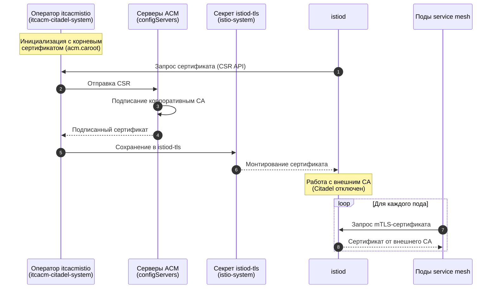

# Принцип работы

Оператор реализует механизм **Kubernetes CSR API** и **Istio CA External Plugin**, позволяя `istiod` запрашивать сертификаты у внешнего центра сертификации вместо встроенного Citadel.

## Ключевые этапы работы

1. Оператор разворачивается в отдельном namespace (`itcacm-citadel-system`) и регистрирует корневой сертификат (`acm.caroot`).
2. При старте или перезапуске `istiod` оператор автоматически формирует запрос на сертификат (CSR) и отправляет его на серверы ACM (`acm.configServers`).
3. ACM подписывает сертификат корпоративным CA и возвращает его. Оператор помещает сертификат в секрет `istiod-tls` (namespace `istio-system`).
4. Конфигурация Istio переключается на внешний CA (отключение встроенного Citadel).
5. Все новые и существующие поды в service mesh получают сертификаты от внешнего CA автоматически (через sidecar-инжектор Istio).

## Схема взаимодействия

## Преимущества

- Полная автоматизация выдачи и ротации сертификатов.
- Соответствие корпоративным требованиям безопасности.

## Ограничения

- Требуется постоянная доступность серверов ACM.
- После установки рекомендуется перезапустить workloads для применения новых сертификатов.
