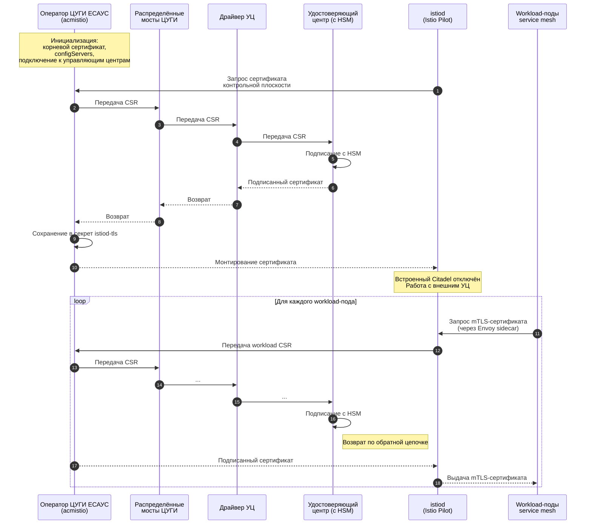

# Принцип работы

Программный компонент **acmistio** (оператор ЦУГИ ЕСАУС) обеспечивает интеграцию service mesh Istio с внешним удостоверяющим центром (УЦ) и заменяет встроенный механизм Citadel Istio на внешний центр сертификации, интегрированный через платформу ЦУГИ.

## Ключевые этапы работы

1. Оператор разворачивается в отдельном namespace (`itcacm-citadel-system`).
2. Оператор регистрирует корневой сертификат (`acm.caroot`) и устанавливает защищённое соединение с мостами ЦУГИ через указанные `configServers`.
3. При старте или перезапуске `istiod` оператор автоматически формирует запрос на сертификат (CSR) контрольной плоскости Istio.
4. CSR передаётся по цепочке:  
   Оператор → Распределённые мосты ЦУГИ → Драйвер УЦ → Удостоверяющий центр (с HSM).
5. УЦ подписывает сертификат с использованием HSM и возвращает его по обратной цепочке. Оператор сохраняет подписанный сертификат в секрет `istiod-tls` (namespace `istio-system`).
6. Применяется конфигурация Istio, отключающая встроенный Citadel и подключающая внешний CA (файл `istio-config-1.12.2.yaml`).
7. После переключения все workload-поды service mesh (через Envoy sidecar и webhook-инжектор Istio) автоматически запрашивают и получают mTLS-сертификаты от внешнего УЦ по той же цепочке.

## Схема взаимодействия

